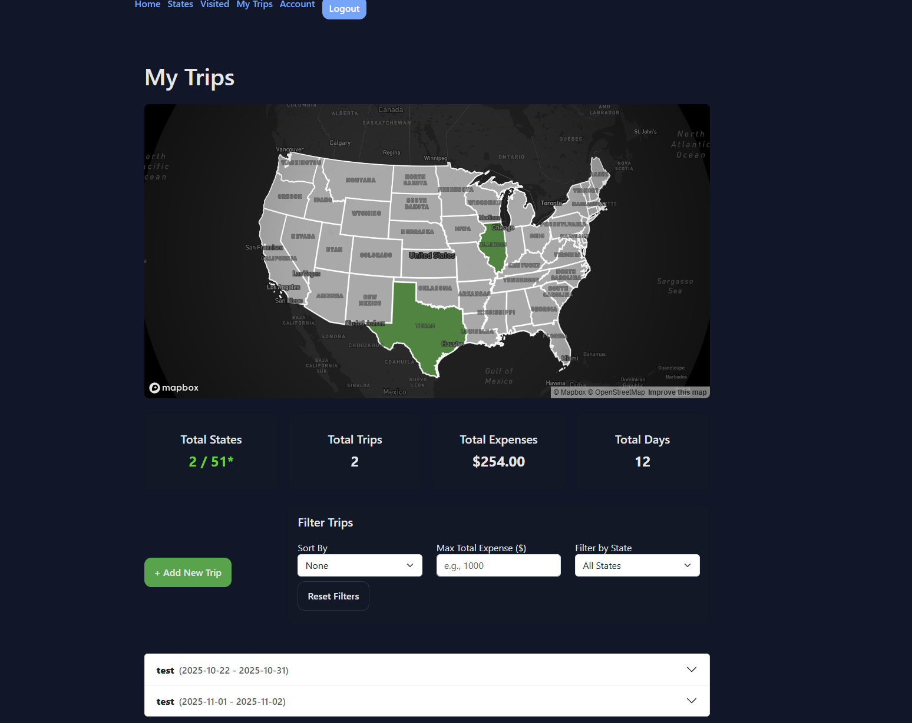
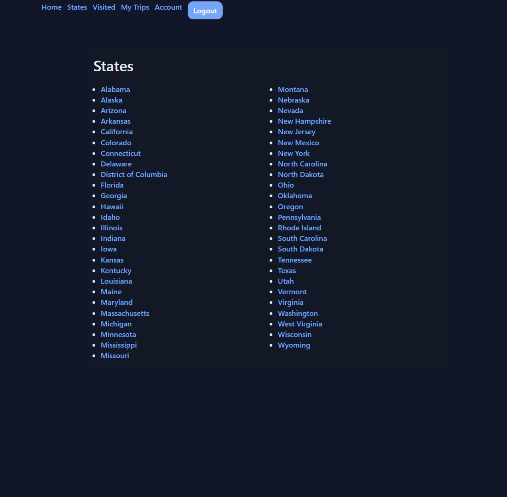
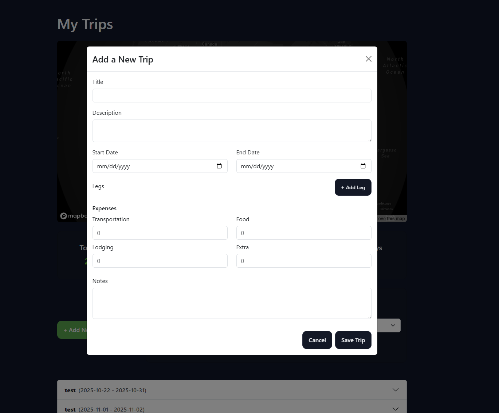

# 🌎 Travel Tracker for the United States

### Authors - Stewart Almeida, Theresa Coleman


[Course: CS5610 Web Development](https://johnguerra.co/classes/webDevelopment_online_fall_2025/)

Instructor: John Alexis Guerra Gomez

[Public Deployment](https://cs5610-project-3-site.onrender.com/)

## 🎞️ Short Video Presentations

[Stewart - My Trips](https://youtu.be/s2tTLCJJgww)

[Theresa - User Account/State Pages](https://youtu.be/2mCPrRhkKbM)


## 🎯 Project Objective

This project is a full-stack web application that lets users track their travels across the United States.
Users can create an account, log trips they’ve taken, and view a color-coded U.S. map that highlights the states they’ve visited.

Each user can:

-- Create an account and securely log in/out

-- Edit or delete their account information

-- Add, edit, and delete trips

-- View travel statistics (total states visited, total trip costs, % of U.S. covered)

-- Browse state detail pages with regional info and fun facts

## 🧠 Tech Stack

-- Frontend	React (Hooks), Vite, HTML5, CSS3

-- Backend	Node.js, Express

-- Database	MongoDB (using official driver, no Mongoose)

-- Libraries	react-simple-maps (for U.S. map), bcryptjs, jsonwebtoken

-- Development Tools	Prettier (code formatting), ESLint (linting), GitHub, VS Code

## 🧑‍🎨 Design Overview

Theresa focused on user account management and authentication, while Stewart focused on trip management and visualization.
Together, these features create a complete travel-tracking experience.

### Key Features
#### 👤 User Accounts (Theresa)

Create account (/register)

Log in securely with JWT cookies

Edit name or email via /account/edit

Delete account permanently

State info pages with JSON data for all 50 states

#### 🗺️ Trip Dashboard (Stewart)

Add trips with start/end destinations and optional legs

Edit or delete trips

Calculate total cost and states visited

Display interactive map using react-simple-maps

## 🧩 Database Structure
Collections
```
users
{
  "_id": ObjectId,
  "name": "Theresa Coleman",
  "email": "theresa@example.com",
  "pass": "hashed_password",
  "createdAt": ISODate,
  "updatedAt": ISODate
}
```

```
trips
{
  "_id": ObjectId,
  "userId": String,
  "title": "Example Trip",
  "description": "Example description",
  "startDate": ISODate,
  "endDate": ISODate,
  "legs": [
  { "_id": ObjectId, "state": "IL", "city": "Chicago", "days": 4, "latitude": null, "longitude": null, "createdAt": ISODate, "updatedAt": ISODate}
  ],
  "expenses": {
  "transportation": 100,
  "food": 50,
  "lodging": 200,
  "extra": 100
  },
  "notes": "Test note",
  "createdAt": ISODate,
  "updatedAt": ISODate
}
```

## ⚙️ Local Installation / Setup / Development
### 🧱 Prerequisites

Node.js 22+

MongoDB running locally (mongodb://127.0.0.1:27017)

Create database called `tripTracker`
- Create two collections: `users` and `trips`
### Scripts

Open 3 terminal windows and run the following commands in their respective window:
1. Window 1: Authentication (PORT 4000)
   ```
   npm run dev:auth
   ```
2. Window 2: Backend (PORT 3000)
   ```
   npm run dev:backend
   ```
3. Window 3: Frontend (Vite, PORT 5174)
   ```
   npm run dev:frontend
   ```


Defaults runs on: http://127.0.0.1:PORT 


Make sure both the frontend and auth-server are running simultaneously.

## 🔐 Environment Variables

Create a .env file inside auth-server with:
```
AUTH_PORT=4000
MONGO_URI=mongodb://127.0.0.1:27017
MONGO_DB=tripTracker
AUTH_SECRET=change-me-to-a-long-random-string
NODE_ENV=development
```
Create a .env file at the project root with:
```
MONGODB_URI=mongodb://127.0.0.1:27017/tripTracker
PORT=3000
MAPBOX_TOKEN=pk.eyJ1Ijoic2FsbWVpZGExOTkzIiwiYSI6ImNtaGxmcDc1bTAwNnAycHE0MHBzMjQyeW4ifQ.CyQk_2C7_6cSQjidPsgjEA
```
Create a .env file inside client with:
```
VITE_MAPBOX_TOKEN=pk.eyJ1Ijoic2FsbWVpZGExOTkzIiwiYSI6ImNtaGxmcDc1bTAwNnAycHE0MHBzMjQyeW4ifQ.CyQk_2C7_6cSQjidPsgjEA
```
## 🧭 Usage Instructions

Visit http://localhost:5174

Register a new user account.

Log in and open your Account Page to edit name or email.

Add trips from your dashboard and view the color-coded map.

Delete account if desired (handled safely with cookie cleanup).

## 🧹 Developer Notes

The project uses Prettier for code formatting.
Run npm run format in the project root to format both client & server.

Cookies are configured for localhost to ensure session persistence.

No Mongoose or Axios were used — only official MongoDB and fetch APIs.

ESLint configuration ensures clean, consistent syntax.

Environment secrets are excluded from source control.

## 📸 Screenshots





## 🌐 Deployment

The application can be deployed with:

Render

Environment variables should match .env from development.

## 🧾 License

This project is licensed under the MIT License.

MIT License © 2025 Theresa Coleman & Stewart Almeida

## 🧪 Smoke Test

After setup:

Start servers.

Visit /register → create an account.

Log in, edit name/email, confirm changes.

Add at least one trip → confirm map highlights visited states.

Refresh page — data should persist.
